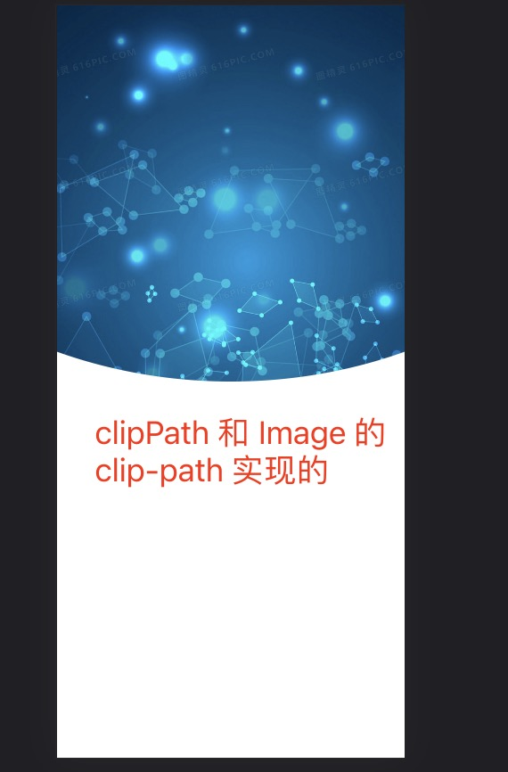

1. svg 全局属性

+ id：用于命名定义，引用的使用使用url(#id) 调用

    例如：

    ```html
    <svg  xmlns="http://www.w3.org/2000/svg"  version="1.1" class="svg">
        <clipPath id="myClip">
        <!--
          圆圈外的所有东西都会被裁剪掉，因此不可见。
        -->
            <ellipse cx="195"   ry="844" rx="844" />
        </clipPath>
        <!--使用url 调用clip-path ="url(#myClip)" -->
        <image 
             height="100%"
             width="100%"
             preserveAspectRatio="xMidYMid slice"
             clip-path ="url(#myClip)" 
             href="https://pic.616pic.com/bg_w1180/00/04/26/XD3UB0lBCx.jpg!/fw/880"
             /> 
      
    </svg>
    ```

+ style,class 设置样式

    + fill: 填充背景颜色，可以是rgba,亦可以是十六进制颜色，或者可以是渐变颜色

    + stroke: 边框颜色

    + stroke-width: 边框宽度

    + opacity: 整体透明度

    + fill-opacity: 背景透明度

    + stroke-opactiy: 边框透明度

    + transform: 转换

+ clip-path: 裁剪，***这个很重要，可以用来做一些特殊的背景***

    

+ fill: 填充图形背景颜色

    <code>
    <svg viewBox="0 0 400 100" xmlns="http://www.w3.org/2000/svg">
    <ellipse cx="50" cy="25" rx="50" ry="25"   fill="yellow"/>
    <ellipse cx="160" cy="50" rx="25" ry="50" fill="blue"/>
    <ellipse cx="260" cy="50" rx="50" ry="50" fill="green"/>
    </svg>
   </code>

   ```svg
    <svg viewBox="0 0 400 100" xmlns="http://www.w3.org/2000/svg">
        <ellipse cx="50" cy="25" rx="50" ry="25"   fill="yellow"/>
        <ellipse cx="160" cy="50" rx="25" ry="50" fill="blue"/>
        <ellipse cx="260" cy="50" rx="50" ry="50" fill="green"/>
    </svg>
   ```
+ 
