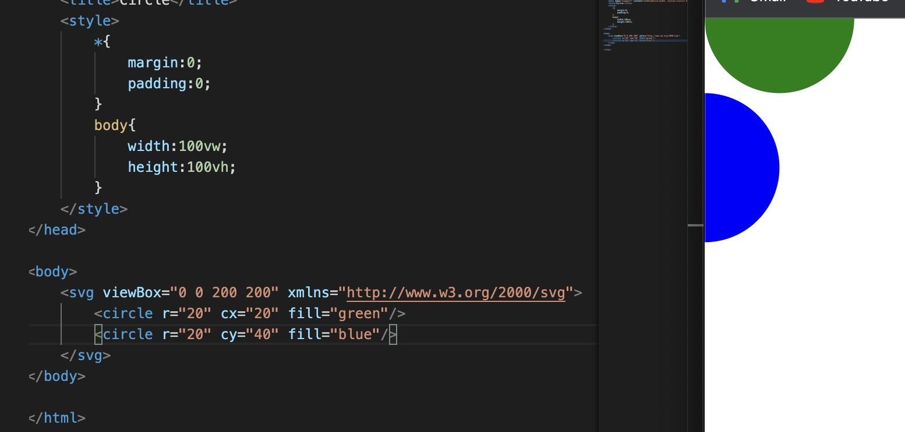
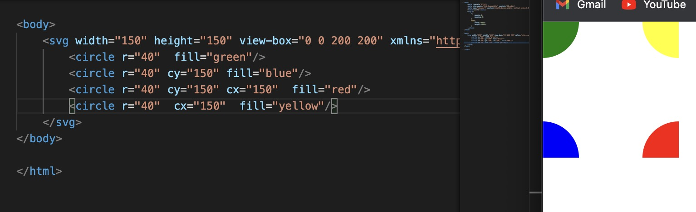

1. circle 圆形

    <code>
         <svg height="100" width="100">
            <circle cx="10" cy="10" r="40" stroke="black" stroke-width="3" fill="red" />
        </svg> 
        
    </code>
    <code>
         <svg height="100" width="100">
            <circle cx="50" cy="10" r="40" stroke="black" stroke-width="3" fill="red" />
        </svg> 
    </code>
    <code>
         <svg height="100" width="100">
            <circle cx="50" cy="50" r="40" stroke="black" stroke-width="3" fill="red" />
        </svg> 
    </code>

    ```html
        <svg height="100" width="100">
            <circle cx="10" cy="10" r="40" stroke="black" stroke-width="3" fill="red" />
        </svg> 

        <svg height="100" width="100">
            <circle cx="50" cy="10" r="40" stroke="black" stroke-width="3" fill="red" />
        </svg> 

         <svg height="100" width="100">
            <circle cx="50" cy="50" r="40" stroke="black" stroke-width="3" fill="red" />
        </svg> 
    ```

2. 属性

+ cx: 圆点中心x 轴坐标,

  圆心的 x 轴坐标。 值类型：<长度> | <百分比> ; 默认值：0;

+ cy: 圆点中心y 轴坐标

    圆心的 y 轴坐标。 值类型：<长度> | <百分比> ; 默认值：0; 

+ r: 圆半径

    圆的半径。小于或等于零的值将禁用圆的渲染。 值类型：<长度> | <百分比> ; 默认值：0

+ fill: 填充背景颜色

+ stroke: 边框颜色

+ stroke-width: 边框宽度

+ clip-path: 裁剪

3. 特殊圆形

+ 半圆

  

+ 四份之一的圆

   