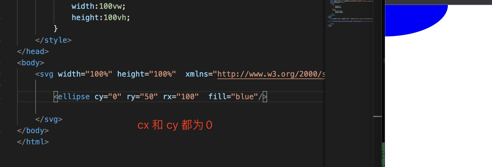

1. ellipse 椭圆形

  <code>
    <svg viewBox="0 0 400 100" xmlns="http://www.w3.org/2000/svg">
    <ellipse cx="50" cy="25" rx="50" ry="25"   fill="yellow"/>
    <ellipse cx="160" cy="50" rx="25" ry="50" fill="blue"/>
    <ellipse cx="260" cy="50" rx="50" ry="50" fill="green"/>
    </svg>
   </code>

   ```html
    <svg viewBox="0 0 400 100" xmlns="http://www.w3.org/2000/svg">
        <ellipse cx="50" cy="25" rx="50" ry="25"   fill="yellow"/>

        <ellipse cx="160" cy="50" rx="25" ry="50" fill="blue"/>

        
        <ellipse cx="260" cy="50" rx="50" ry="50" fill="green"/>
    </svg>
   ```

2. 属性

+ cx:椭圆中心的 x 位置。 值类型：<长度> | <百分比> ; 默认值：0

+ cy:椭圆中心的 y 位置。 值类型：<长度> | <百分比> ; 默认值：0;

+ rx:  x轴上椭圆的半径。 值类型：auto| <长度> | <百分比> ; 默认值：auto; 

+ ry: y 轴上椭圆的半径。 值类型：auto| <长度> | <百分比> ; 默认值：auto;

   > 当rx 和 ry 相等时画出的是圆形

3. 特殊情况的椭圆ellipse

+ 只有cx 和 rx时，ry 默认和rx 值一样，是一个半圆

    

+ cy 为0, 如果没有设置cy, 那么默认为0，即起始点为svg 的起点

    

+ cx 为0

    

+ cx 为0，cy 为0， 只有4分之一的椭圆

    

4. clip-path: 裁剪图像

    